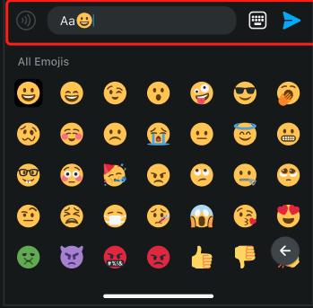

# [ComponentRegister](https://github.com/zjc19891106/ChatroomUIKit/blob/main/Sources/ChatroomUIKit/Classes/UI/Core/UIKit/Utils/ComponentsRegister.swift)

An object containing types of UI Components that are used through the ChatroomUIKit SDK.

## Classes that can be inherited and modified

1. ``ComponentsRegister.shared.GiftBarragesViewCell``..

2. ``ComponentsRegister.shared.GiftEntityCell``..

3. ``ComponentsRegister.shared.ChatInputBar``..

4. ``ComponentsRegister.shared.ChatBarrageCell``..

5. ``ComponentsRegister.shared.ReportOptionsController``..

6. ``ComponentsRegister.shared.ParticipantsViewController``..